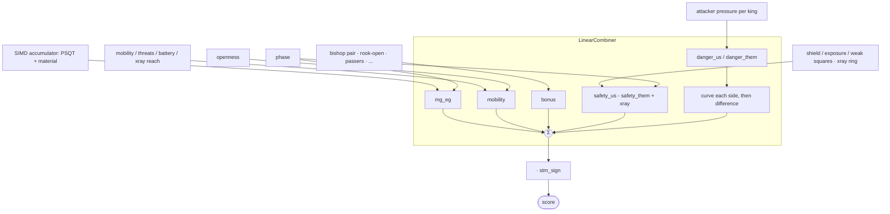

# The Eval Tuner

Gradient descent on Soul's hand-crafted eval, against WDL-labeled positions.
The recipe for adding a term is [ADDING_EVAL_TERMS.md](ADDING_EVAL_TERMS.md).

---

## The gradient is a feature coefficient

The eval is a weighted sum, `score = Σ featureᵢ · weightᵢ`, and the tuner minimizes
`L(σ(K·score), target)` over millions of positions, K converting a centipawn to a win probability.
Cross-entropy by default; MSE, focal and label-smoothed CE are config options. `wdl_target` sets
the target between the game result and `σ(K·search_score)`, leaning on the search where it was
decisive and on the result where it was not.

Because the eval is linear in its parameters, a weight's gradient is the feature standing next to
it:

```text
∂score/∂wᵢ = featureᵢ
```

No calculus at runtime, only bookkeeping scaled by the outer derivative `∂L/∂score`. That is worth
one rule: **every non-linearity lives in the combiner, never in a term.** King danger is the live
case, `pressure + pressure²·curvature/DANGER_SCALE`, so it sits in `LinearCombiner` and reaches the
term as a per-side slope. Put a parameter inside an activation in a term and the scatter computes a
wrong gradient in silence.

## Two paths to it

**`eval_linear_grad`** reads the coefficients off the board and scatters them. Its cached twin in
`gradient.rs` does the same from a `FeatureRecord`, features packed to `i8` once at startup, and
that is what every epoch runs.

**`eval_dual_fused`** is forward-mode autodiff: every number holds its gradient vector, so the
product rule fires on each multiply and linearity is never assumed. It is a test, not a path. Run
both, diff the gradients, and a disagreement means the hand-derived formula is wrong.

Both hardcode squared error. They exist to be diffed against each other, so the configured loss
would only add a factor both sides share.

## Buckets

Terms write into per-bucket accumulators; the combiner collapses them and flips for side to move.
The buckets are the stable shape, not the term list.



`bonus` takes any linear term that splits into mg and eg; the combiner tapers the pair once, as it
does the safety block. A term earns a bucket of its own only when the combiner must treat it
differently: its own activation, its own taper.

One `evaluate_generic<T>` serves all three consumers. `T` is `i32` in search with the weights
const-inlined, `f64` for the tuner's score, and `DualNode` for the oracle, whose `[f32; DUAL_N]`
sizes itself from the tunable count.

## Scale

Scaling the weights by `c` and dividing K by `c` leaves every prediction identical, so the eval's
overall size is a direction the loss cannot see. `material[p] + psqt[p][sq]` is a piece's whole
contribution, which makes a constant moved between the two invisible as well. Lion moves along both
regardless, since its step is `±lr` whatever the gradient says.

`scale.rs` closes both. `canonicalize` folds each piece's mean PSQT into its material term after
every step, and `Gauge` measures Σ|score| over a fixed probe of positions, rescaling the vector
back onto that reference with K and Lion's momentum taken along. A run that starts on the shipped
weights is gauged every batch; a cold start has no scale to hold yet and takes the correction once
on the way out. Either way the output is in the centipawns `search_params` was written against, and
the report's `Gauge:` line says how much of that scale the loss could not hold by itself. K itself
can move during the run, by golden section every few epochs or by a sign step of its own.

## Files

| File | What it holds |
|---|---|
| `src/engine/eval.rs` | `evaluate_generic<T>`, the `bonus_terms!` roster, `register_terms!` |
| `src/engine/eval_params.rs` | Weight arrays, the slot map, `Tunable` descriptors |
| `src/engine/combiner.rs` | `LinearCombiner`, and every non-linearity |
| `src/engine/autograd/dual.rs` | `DualNode` |
| `src/core/psqt.rs` | PSQT layout and index mapping |
| `src/tools/dataset/tape.rs` | `eval_linear_grad`, `eval_dual_fused`, the oracle tests |
| `src/tools/dataset/gradient.rs` | `FeatureRecord` and the cached scatter |
| `evaltuner/src/config.rs` | The TOML schema and the loss functions |
| `evaltuner/src/run.rs` | Datasets in, epoch loop, checkpoints out |
| `evaltuner/src/lion.rs` | Lion, and the gate that holds a step |
| `evaltuner/src/scale.rs` | K, the gauge, and the PSQT/material fold |
| `evaltuner/src/report.rs` | The paste block and the epoch line |
| `evaltuner/src/probes.rs` | The one-shot measurements below |

## Probes

Each answers a question the epoch line cannot, over the same load and split a run would use.

- `curvature` reports what the data determines, what it leaves free, and which parameters restate
  each other.
- `batch-size` finds where averaging stops reducing gradient noise, and how much of a batch that
  size points the wrong way, which is the half a sign optimizer pays for.
- `momentum` balances that noise against the staleness of what momentum still holds, and prints the
  β₂ where they meet.
- `gather-cost` times the gradient pass over sequential, blocked and shuffled orders.
- `val-cost` times the fused validation traversal against the two it replaced.

`make flops` prices the gradient itself, differencing retired FLOPs and cycles over the same bench
positions. Read cycles rather than the clock: boost state moves wall time 10% between runs of one
binary.

## Floating point

Subnormals never reach the hot loop, and not by touching MXCSR: setting FTZ/DAZ is immediate UB,
because Rust assumes the default floating-point environment and optimizes on that whether or not
the register is restored. Three structural guards do it instead. `sigmoid` clamps its exponent to
±700, short of libm's very slow subnormal path between −708 and −744. Lion zeroes momentum once it
and the gradient both fall under 1e-9. And every EMA starts at zero, so a parameter that never sees
a gradient contributes exact zeros rather than a residue shrinking toward one.
