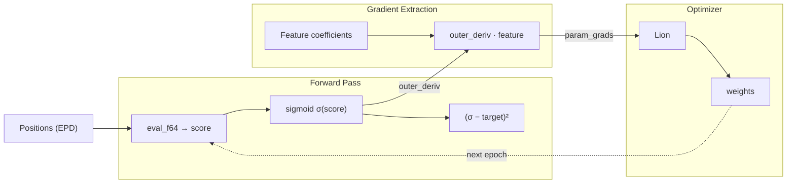
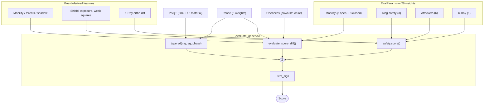

# The Eval Tuner

*How it works and why it's structured the way it is.*

---

## The Core Idea

Think of evaluation parameters like the knobs on a mixing board.
Each knob controls how much weight a specific positional feature gets — how important is a pawn shield?
How much do we reward mobility?
The tuner's job is to find the knob positions that minimize the gap between what the engine
thinks about a position and what actually happened in real games.

The engine computes `score = Σ(feature_i · weight_i)`. The tuner adjusts the weights
to minimize `(sigmoid(score) - game_result)²` across millions of positions.

To do that, we need gradients — for each weight, which direction should we turn
the knob, and how far?

## Two Gradient Engines

The tuner has two independent systems for computing gradients.
They produce the same answers but work in fundamentally different ways:

### The Direct Path — production (`eval_linear_grad`)

Since our eval is a linear function of its parameters — every weight appears as
`weight · board_feature` — the gradient for each weight is simply its feature
coefficient. No calculus required at runtime, just bookkeeping.

If you know `score = 3 · w_shield + 7 · w_mobility + ...`, then `d(score)/d(w_shield) = 3`.
That number `3` depends on the board, not on the weight values.

This is what `eval_linear_grad` computes: it evaluates the position, then extracts
each feature coefficient directly from the board state, phase, and openness.
Cost: ~90 f64 operations for feature coefficients, plus the eval itself.
This is what runs in the training loop.

### The Dual Number Path — oracle (`eval_dual_fused`)

This is a general-purpose automatic differentiation engine.
It works by replacing every number in the computation with a "dual number",
value paired with a gradient vector. When you multiply two dual numbers,
the product rule happens automatically. When you add them, the gradients add.

It handles any function, not just linear ones.
If you ever added `sigmoid(w₁ · w₂)` to the eval, the dual path would still give correct gradients.
The direct path would not — you'd need to update it.

The dual path lives as a correctness oracle. When you add a new eval term and write
its gradient formula, you can run both paths and compare.
If they disagree, your hand-derived formula has a bug.

## Architecture

### Training Loop

### Eval Internals

**Three instantiations of `T`:**

| Context | `T` type | What it does |
|---------|----------|-------------|
| Engine search | `i32` | Fast integer eval, const-inlined weights |
| Tuner score | `f64` | Floating-point eval for sigmoid/loss |
| Tuner oracle | `DualNode` | Forward-mode AD, carries `[f32; 32]` gradient array |

## Files

| File | What it does |
|------|-------------|
| `src/engine/eval.rs` | `evaluate_generic<T>` — the eval, generic over math type |
| `src/engine/eval_params.rs` | Const arrays for weights, `Tunable` descriptors |
| `src/engine/autograd/dual.rs` | `DualNode` — forward-mode AD engine |
| `src/core/psqt.rs` | PSQT layout, parameter offsets, index mapping |
| `tuner/src/evaltune/tape.rs` | `eval_linear_grad` (production), `eval_dual_fused` (oracle), `eval_f64` (score-only) |
| `tuner/src/evaltune/evaltuner.rs` | Training loop, optimizer, scheduling |
| `tuner/src/evaltune/training.rs` | `TrainableEntry` trait (used by encoded `.soul.zst` path) |

## Performance Notes

The direct path adds zero overhead to the eval itself — it calls `eval_f64`
for the score and computes feature coefficients separately.
The cost is dominated by the eval, not the gradients.

The FTZ/DAZ flags (Flush-To-Zero, Denormals-Are-Zero) are set on every Rayon worker
thread via a `start_handler` in `evaltune.rs`.
Without these, subnormal floats *might* cause 4-10× slowdowns on specific gradient values as training converges.

---

**→ See [ADDING_EVAL_TERMS.md](ADDING_EVAL_TERMS.md) for the step-by-step recipe
for wiring new evaluation parameters.**
