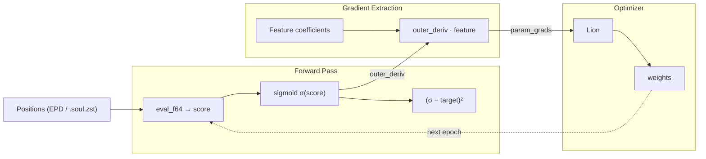
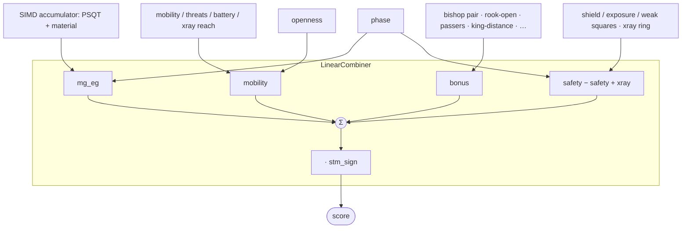

# The Eval Tuner

How it works, and why it's shaped this way.

---

## The core idea

Evaluation parameters are the knobs on a mixing board.
Each one sets how much a positional feature counts: what a pawn shield is worth, how much mobility earns.
Tuning is finding the knob positions that close the gap between what the engine thinks of a position and what actually happened in the games.

The engine computes `score = Σ(featureᵢ · weightᵢ)`.
The tuner moves the weights to minimize `(sigmoid(score) − result)²` over millions of positions.
To move a weight you need its gradient: which way to turn the knob, and how far.

## Two ways to get the gradient

The eval is linear in its parameters: every weight shows up as `weight · feature`.
So a weight's gradient is just its feature coefficient: no calculus at runtime, only bookkeeping.
If `score = 3·w_shield + 7·w_mobility + …`, then `∂score/∂w_shield = 3`, and that `3` is a fact about the board, not about the weight's value.

**Direct (`eval_linear_grad`): production.** Evaluate the position, read each feature coefficient straight off the board, phase, and openness, scatter `outer_deriv · coefficient` into the gradient vector. ~90 f64 ops on top of the eval itself. This is what runs every epoch.

For encoded `.soul.zst` datasets the direct path has a cached twin in `src/tools/dataset/gradient.rs`: the features are packed into `i8` once at startup, so the epoch loop never recomputes the spatial tensor. Same math, packed storage: both directions dispatch through `LinearTerm`, so a new term brings its packing there, not its math. Miss the row and the build fails, miss the pack and `test_encoded_block_coverage_oracle` names the block.

**Dual (`eval_dual_fused`): oracle.** Forward-mode autodiff: every number carries its gradient vector, the product rule fires on each multiply, the chain rule falls out for free.
It handles any function, linear or not: drop a `sigmoid(w₁·w₂)` into the eval and it still returns the right gradient where the direct path would quietly hand you a wrong one.
It earns its keep as a check; run both, diff the gradients, and disagreement means the hand-derived formula has a bug. The per-term tests in `tape.rs` are exactly that diff.

## Architecture

### Training loop

### The eval, by bucket

`evaluate_generic<T>` fills per-bucket accumulators, the combiner sums them, then the score flips for side to move.
Each term writes one bucket; the buckets are the stable shape, not the term list.
Anything non-linear lives in the combiner, never in a term: that's the line that keeps the direct gradient honest.

The `bonus` bucket is the cheap home for any pre-tapered linear term; a term earns its own bucket only when it needs a combiner shape of its own: an activation, a different taper.
See [ADDING_EVAL_TERMS.md](ADDING_EVAL_TERMS.md).

**`T` resolves three ways, one code path:**

|    Context    |     `T`    |                                      What it does                                     |
|---------------|------------|---------------------------------------------------------------------------------------|
| Engine search | `i32`      | Fast integer eval, weights const-inlined                                              |
| Tuner score   | `f64`      | Float eval for sigmoid and loss                                                       |
| Tuner oracle  | `DualNode` | Forward-mode AD, carries `[f32; DUAL_N]`: `DUAL_N` self-sizes from the tunable count  |

## Files

|                File               |                                               What it does                                             |
|-----------------------------------|--------------------------------------------------------------------------------------------------------|
| `src/engine/eval.rs`              | `evaluate_generic<T>`: the eval, generic over the math type; terms and `register_terms!`               |
| `src/engine/eval_params.rs`       | Weight arrays, the `define_layout!` slot map, `Tunable` descriptors                                    |
| `src/engine/combiner.rs`          | `LinearCombiner`: collapses buckets to a scalar, owns every non-linearity                              |
| `src/engine/autograd/dual.rs`     | `DualNode`: forward-mode AD engine                                                                     |
| `src/core/psqt.rs`                | PSQT layout, parameter offsets, index mapping                                                          |
| `tuner/src/evaltune/tape.rs`      | `eval_linear_grad` (production), `eval_dual_fused` (oracle), `eval_f64` (score-only)                   |
| `src/tools/dataset/gradient.rs`   | Cached SoA gradient for `.soul.zst`: `FeatureRecord`, `eval_record`, `accumulate_record_grad`          |
| `tuner/src/evaltune/evaltuner.rs` | Training loop, optimizer, scheduling                                                                   |

## Performance notes

The direct path adds nothing to the eval: it calls `eval_f64` for the score and derives the feature coefficients alongside. The cost is the eval, not the gradient.

Subnormals are kept out of the hot loop by construction rather than by MXCSR flags. `sigmoid` clamps its exponent to ±700, short of libm's very slow subnormal fallback between −708 and −744, which ignores FTZ/DAZ anyway; Lion hard-zeroes momentum once both it and the gradient fall under 1e-9; and the decaying EMAs start at zero for exactly the parameters whose gradients go quiet.
Setting FTZ/DAZ instead would be immediate UB: Rust assumes the floating-point environment is in its default state and optimizes on that, whether or not the register is restored afterwards.

---

**→ [ADDING_EVAL_TERMS.md](ADDING_EVAL_TERMS.md): the step-by-step recipe for wiring a new term.**
