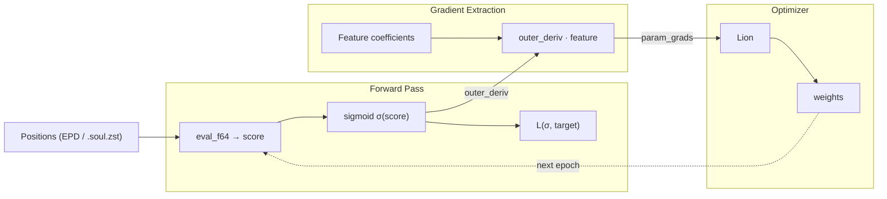
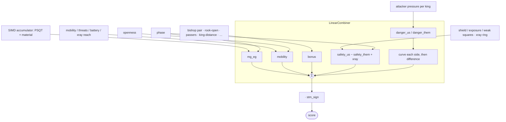

# The Eval Tuner

How it works, and why it's shaped this way.

---

## The core idea

Evaluation parameters are the knobs on a mixing board.
Each one sets how much a positional feature counts: what a pawn shield is worth, how much mobility earns.
Tuning is finding the knob positions that close the gap between what the engine thinks of a position and what actually happened in the games.

The engine computes `score = Σ(featureᵢ · weightᵢ)`.
The tuner moves the weights to minimize `L(sigmoid(score), target)` over millions of positions: cross-entropy by default, with MSE, focal and label-smoothed CE selectable in the config.
The target is not the game result alone: `wdl_target` blends it with `sigmoid(search_score)`, trusting the eval where the search was decisive and falling back to the result where it was near zero, or entirely when the position carries no score.
To move a weight you need its gradient: which way to turn the knob, and how far.

---

## Two ways to get the gradient

The eval is linear in its parameters, king danger aside: every weight shows up as `weight · feature`.
So a weight's gradient is just its feature coefficient: no calculus at runtime, only bookkeeping.
If `score = 3·w_shield + 7·w_mobility + …`, then `∂score/∂w_shield = 3`, and that `3` is a fact about the board, not about the weight's value.

**Direct (`eval_linear_grad`): the reference.** Evaluate the position, read each feature coefficient straight off the board, phase, and openness, scatter `outer_deriv · coefficient` into the gradient vector. Around 320 f64 ops and 90 ns per position on top of the eval itself, priced by `make flops`. It has one caller, the oracle test; what runs every epoch is the cached twin below.

**Dual (`eval_dual_fused`): the oracle.** Forward-mode autodiff: every number carries its gradient vector, the product rule fires on each multiply, the chain rule falls out for free.
It handles any function, linear or not: drop a `sigmoid(w₁·w₂)` into the eval and it still returns the right gradient where the direct path would quietly hand you a wrong one.
It earns its keep as a check; run both, diff the gradients, and disagreement means the hand-derived formula has a bug. `test_bonus_terms_oracle` in `tape.rs` is exactly that diff, walking the roster so every term is covered by the row that declares it.

`eval_linear_grad` and `eval_dual_fused` both hardcode squared error, since they exist to be diffed against each other rather than to train. The configured loss reaches the epoch loop only as the outer derivative `∂L/∂score` that scales every scatter, so it never changes what the two paths are asked to agree on.

For encoded `.soul.zst` datasets the direct path has a cached twin in `src/tools/dataset/gradient.rs`: the features are packed into `i8` once at startup, so the epoch loop never recomputes the spatial tensor.
Both directions dispatch through `LinearTerm`, so a new term brings its packing there, not its math.
Miss the row and the build fails, miss the pack and `test_encoded_block_coverage_oracle` names the block.

---

## Architecture

### Training loop

### The eval, by bucket

`evaluate_generic<T>` fills per-bucket accumulators, the combiner sums them, then the score flips for side to move.
Each term writes one bucket; the buckets are the stable shape, not the term list.
Anything non-linear lives in the combiner, never in a term: that's the line that keeps the direct gradient honest.
King danger is the live example. Each side's attacker pressure is curved before the two are differenced, so the term stays a linear feature sum and the curve's derivative reaches it as a per-side upstream.

The `bonus` bucket is the cheap home for any pre-tapered linear term; a term earns its own bucket only when it needs a combiner shape of its own: an activation, a different taper.

### One declaration, many consumers

A tapered bonus is declared once, as a row of the `bonus_terms!` roster in `eval.rs`, and the build derives every other place it used to be named. [ADDING_EVAL_TERMS.md](ADDING_EVAL_TERMS.md) lists what falls out.

Two mechanisms carry it. A list hands its rows to a named consumer instead of expanding in place, so `eval.rs`, `gradient.rs` and `tape.rs` all build from the one row. And lists chain: `define_tunables!` holds the core weight rows and passes them through the roster, so a single consumer receives both as one flat sequence and neither declaration repeats the other.

A term can no longer be half-declared. Every list that could once disagree with another is the same list now, and the three that stay separate fail loudly: a values row that drifts fails the paste-block test, a block out of order fails the layout assert naming the block, and a wrong constant fails the oracle.

**`T` resolves three ways, one code path:**

|    Context    |     `T`    |                                      What you get                                     |
|---------------|------------|---------------------------------------------------------------------------------------|
| Engine search | `i32`      | Fast integer eval, weights const-inlined                                              |
| Tuner score   | `f64`      | Float eval for sigmoid and loss                                                       |
| Tuner oracle  | `DualNode` | Forward-mode AD, carries `[f32; DUAL_N]`: `DUAL_N` self-sizes from the tunable count  |

---

## Files

|                File               |                                               What it does                                                   |
|-----------------------------------|--------------------------------------------------------------------------------------------------------------|
| `src/engine/eval.rs`              | `evaluate_generic<T>`: the eval, generic over the math type; the `bonus_terms!` roster and `register_terms!` |
| `src/engine/eval_params.rs`       | Weight arrays, the core half of the slot map and the tunable list, `Tunable` descriptors                     |
| `src/engine/combiner.rs`          | `LinearCombiner`: collapses buckets to a scalar, owns every non-linearity                                    |
| `src/engine/autograd/dual.rs`     | `DualNode`: forward-mode AD engine                                                                           |
| `src/core/psqt.rs`                | PSQT layout, parameter offsets, index mapping                                                                |
| `src/tools/dataset/tape.rs`       | `eval_linear_grad` (reference), `eval_dual_fused` (oracle), `eval_f64` (score-only), the oracle tests        |
| `src/tools/dataset/gradient.rs`   | Cached SoA gradient for `.soul.zst`: `FeatureRecord`, `eval_record`, `accumulate_record_grad`                |
| `tuner/src/core/config.rs`        | `TunerConfig`: schedules, batch size, and the loss the epoch loop applies                                    |
| `tuner/src/evaltune/run.rs`       | The run: datasets in, epoch loop, checkpoints out                                                            |
| `tuner/src/evaltune/lion.rs`      | Lion: sign-of-blend steps, the optimizer the loop drives                                                     |
| `tuner/src/evaltune/report.rs`    | `write_params`: prints the paste block, keyed to the block-name comments                                     |

---

## Performance notes

The direct path rides on the eval: `eval_f64` for the score, the feature coefficients derived alongside.
`make flops` prices it, differencing a retired-FLOP counter across two runs of the same bench positions, one scoring only and one scoring plus scattering. The gradient costs 317 ops and ~90 ns per position against the eval's own 334 and ~170 ns; the scatter is 292 of those ops and the sigmoid with its loss derivative the other 25. Ops there are FLOPs, so an FMA or a packed lane counts per element.

Subnormals are kept out of the hot loop by construction rather than by MXCSR flags. `sigmoid` clamps its exponent to ±700, short of libm's very slow subnormal fallback between −708 and −744, which ignores FTZ/DAZ anyway; Lion hard-zeroes momentum once both it and the gradient fall under 1e-9; and the decaying EMAs start at zero for exactly the parameters whose gradients go quiet.
Setting FTZ/DAZ instead would be immediate UB: Rust assumes the floating-point environment is in its default state and optimizes on that, whether or not the register is restored afterwards.

---

**→ [ADDING_EVAL_TERMS.md](ADDING_EVAL_TERMS.md): the step-by-step recipe for wiring a new term.**
